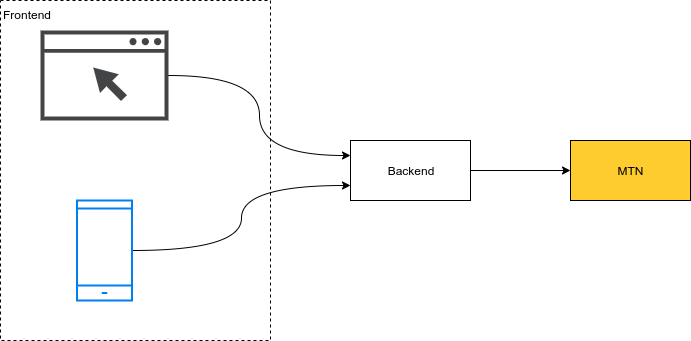

class: center, middle
background-color: #ffcc30

.center[]

### Deep Dive Into

# MTN MoMo API

### with NodeJS

---

class: middle

### Speaker

# Ernest Okot

- Author of `mtn-momo` library

- Founder at FreelyFormd

- 5+ years building modern web applications with JS

---

background-image: url(images/mmpic.jpg)
class: middle

# Agenda

Overview

Getting started

Architecture

Collections

Errors

Disbursements

---

class: center, middle
background-color: #ffcc30

# Overview

---

class: middle

## What MTN Mobile Money provides?

- sim card as a financial account
- sending and receiving money
- **withdraw and deposit through agents**
- payments (utilities, momo pay, online)
- network services (airtime, bundles)
- **remittances**

---

class: middle

# Your software is a virtual agent

# with the Open API

- withdraw from an account with the Collections API
- deposit with Disbursements API
- send money abroad with the Remittances API (NOT COVERED)
- ability to collect payments using MoMo Pay (NOT COVERED)

---

class: center, middle
background-color: #ffcc30

# Getting started

---

class: middle

## Developer Account

- Sign up on https://momodeveloper.mtn.com/

- Subscribe to Collections and Disbursement and obtain primary key for each

---

class: middle

## Installation

In a NodeJS project:

```sh
npm install mtn-momo --save
```

This will install

- the latest `mtn-momo` as a dependency
- the `momo-sandbox` command line tool

---

class: middle

## Sandbox credentials

Generate sandbox credentials using the command line tool;

```sh
$ npx momo-sandbox --host example.com --primary-key 028b71f923f24df9a3d9fe90a6453
Momo Sandbox Credentials {
  "userSecret": "5cf088d3dc92441c8490122523cb884e",
  "userId": "e9dd3eb0-d67b-48d2-a7bb-4ed4dadd952c"
}
```

- Host is your application's domain

- Primary key is your subscription key from momodeveloper account

- You will get a user secret and user id which we will use later

- We have to do this separately for collections and disbursement

---

class: middle

## Importing the library

- With commonjs

```js
const MoMo = require("mtn-momo");
```

- With es6

```js
import * as MoMo from "mtn-momo";
```

---

class: middle

## Initializing the library

```js
const momo = MoMo.create({
  callbackHost: "example.com"
});
```

---

class: center, middle
background-color: #ffcc30

## Architecture

---

class: center, middle

.center[]

---

class: center, middle

## For maximum security, implement the integration with MTN in your backend

This way, you will not need any secret keys in your client

---

class: center, middle
background-color: #ffcc30

# Collections

Withdraw money from your customer's account

---

class: middle

## Initializing collections

```js
const collections = momo.Collections({
  userSecret: "...",
  userId: "...",
  primaryKey: "..."
});
```

---

class: middle

## Requesting a payment

- Call `requestToPay`, it returns a promise that resolves a transaction id or rejects with an error
- You can store the transaction id for later use

```js
collections
  .requestToPay({
    amount: 50,
    currency: "EUR",
    externalId: "123456",
    payer: {
      partyIdType: MoMo.PayerType.MSISDN,
      partyId: "256774290781"
    },
    payerMessage: "testing",
    payeeNote: "hello",
    callbackUrl: "https://example.com/collections/callback"
  })
  .then(transactionId => console.log({ transactionId }))
  .catch(error => console.log({ error }));
```

---

class: middle

## Requesting a payment

- In sandbox, use EUR as the currency ¯\\\_(ツ)\_/¯
- In production, use the currency of your country
- Use reference of your database transaction record as `externalId`
- `payerMessage` appears on your customer's statement
- `payeeNote` appears on your statement (as a virtual agent)

---

class: middle

# But the payment is not yet complete

As an agent, you cannot exchange your goods until you are sure the payment has transferred to your account

So how can you be sure that the transaction has been completed?

---

class: middle

# Polling

- Before exchanging goods, call `getTransaction` with the transaction id every few seconds until it succeeds or fails
- This technique is known as polling
- In NodeJS, you can use `setTimeout` or `setInterval` to do this
- Your backend won't send a response to the client until when the transaction fails or succeeds
- The HTTP connection from your client will need to stay open for up to a few minutes, make sure to adjust timeout confuguration to allow this
- A more robust solution for polling is to use a queue worker instead of `setTimeout` or `setInterval`

---

class: middle

# Callback

- if you do not want to poll, you can setup an API endpoint to receive requests from MTN when the transaction status changes,
- you can pass the endpoint url as part of `requestToPay`
- your endpoint should be called when the transaction fails or succeeds
- Note that callbacks do not currently work in the sandbox (WTF?)

---

class: middle

# Errors

- `requestToPay` creates a transaction that may fail immediate or eventually. If it fails immediately, the returned promise will reject with an appropripate error.
- `catch` the promise rejection to handle the error appropriately
- `getTransaction` also fails if the transaction has failed
- if an error is associated with a transaction, `error.transaction` will hold the transaction object

---

class: middle

# Errors

- a transaction can fail immediately if;
  - credentials are incorrect/invalid/expired
  - the provided parameters are invalid (depending on the environment)
  - the phone number is not registered for mobile money
  - the customer has insufficient balance
- a transaction can fail eventually if;
  - the customer cancels the transaction
  - transaction times out

---

class: middle

# Errors

- all error classes are subclasses `Momo.MtnMomoError`
- you can access all error classes in the `MoMo` object e.g `MoMo.ApprovalRejectedError`

---

class: center, middle
background-color: #ffcc30

# Disbursements

Deposit money to a mobile money account

---

class: middle

## Initializing disbursements

```js
const disbursements = momo.Disbursements({
  userSecret: "...",
  userId: "...",
  primaryKey: "..."
});
```

NOTE: remember to use a generate new credentials using a disbursements primary key

---

class: middle

## Making a payment

- Call `transfer`, it returns a promise that resolves a transaction id or rejects with an error
- You can store the transaction id for later use

```js
disbursements
  .transfer({
    amount: "100",
    currency: "EUR",
    externalId: "947354",
    payee: {
      partyIdType: "MSISDN",
      partyId: "+256776564739"
    },
    payerMessage: "testing",
    payeeNote: "hello",
    callbackUrl: "https://example.com/disbursements/callback"
  })
  .then(transactionId => console.log({ transactionId }))
  .catch(error => console.log({ error }));
```

---

class: middle

## Making a payment

- Same as collections;
  - In sandbox, use EUR as the currency ¯\\\_(ツ)\_/¯
  - In production, use the currency of your country
  - Use a reference of your database record as `externalId`
- `payerMessage` appears on your statement
- `payeeNote` appears on the receiver's statement

---

class: middle

## Making a payment

- Since there is no approval process for disbursements, it safe to assume they complete immediately
- For 100% certainty, you can poll using `disbursements.getTransaction` or use the callback
- Error handling is same as collections